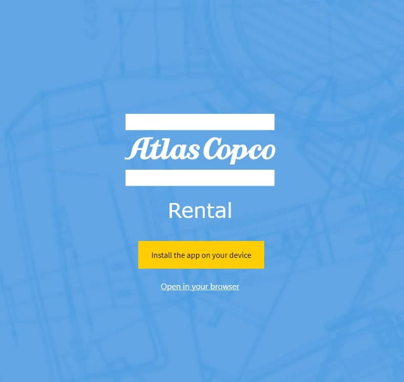
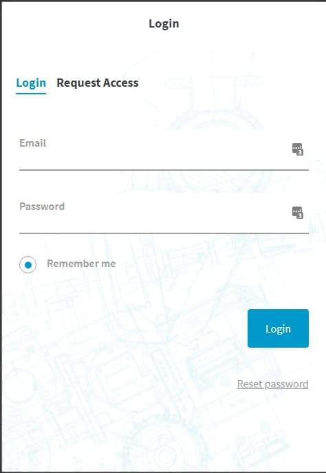
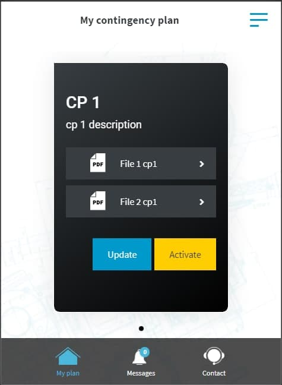
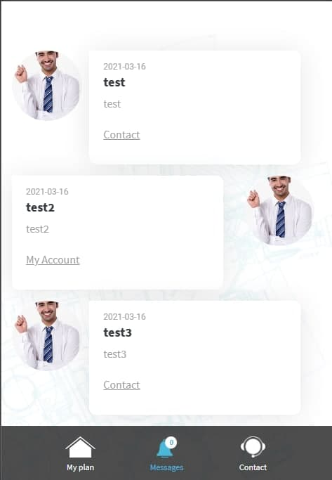
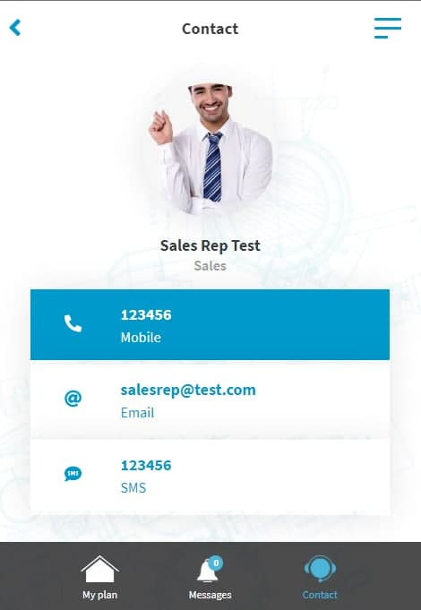
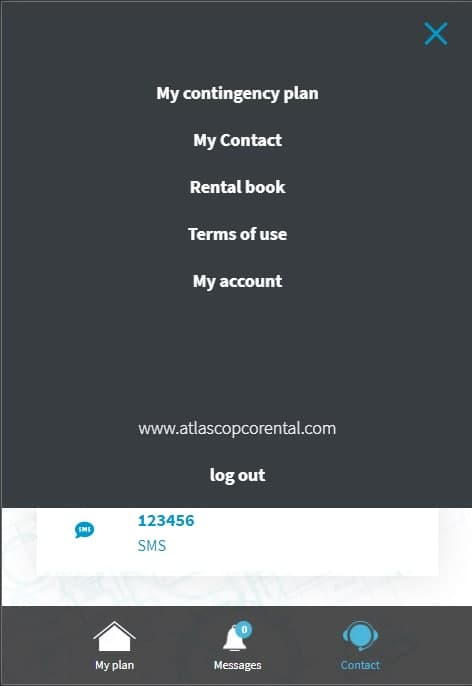
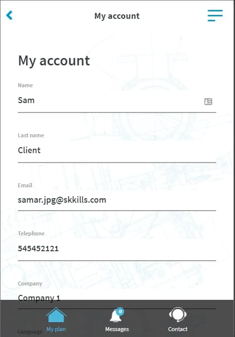

# Acrental PWA

### The system has been developed to manage contingency plans of a company, provides user manuals in PDF format, with steps to follow in case of any unplanned event.

### The system behaves as a mobile application and web page, through the use of Progressive Web Application (PWA), whose functionality allows it to be installed on mobile devices and desktop computers.

### Through the use of IONIC we were able to generate an APK file to offer the client an additional way of installation on mobile devices.

## Development technologies

- VueJs
- Ionic

## Funciones

- User Profile
  - Functionality to view and update the user profile with basic data such as, Names, Emails, Phones, Password and profile picture.
- Chat with assigned representative
- Representative profile with basic data such as Phone, Email and the ability to send an SMS.
- Login
- Request Access: Users must request prior access in order to log in to the application.
- Reset Password

* Term Of Use

| -                                                                                                | -                                                                        |
| ------------------------------------------------------------------------------------------------ | ------------------------------------------------------------------------ |
|                            |  |
|  |    |
|                    |    |
|                  |
